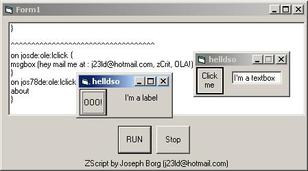



## Z Script scripting language

### Description

this is scripting language wich is about 40% ready is a good example of how to load any object at runtime including forms buttons labels etc... hope you'll like it... i think i'll continue it or start it agian using better programming methods... i'll try to make it compile the code although lots of you say that you can't its just that i don't have time :) cu pls leave a comment!!!!!
 
### More Info
 
this is scripting language wich is about 40% ready is a good example of how to load any object at runtime including forms buttons labels etc... hope you'll like it... i think i'll continue it or start it agian using better programming methods... cu pls leave a comment!!! :)

             |
---                |---
**Submitted On**   |2002-10-05 16:23:32
**By**             |[Joseph Borg](https://github.com/Planet-Source-Code/PSCIndex/blob/master/ByAuthor/joseph-borg.md)
**Level**          |Intermediate
**User Rating**    |5.0 (30 globes from 6 users)
**Compatibility**  |VB 4\.0 \(32\-bit\), VB 5\.0, VB 6\.0
**Category**       |[Object Oriented Programming \(OOP\)](https://github.com/Planet-Source-Code/PSCIndex/blob/master/ByCategory/object-oriented-programming-oop__1-47.md)
**World**          |[Visual Basic](https://github.com/Planet-Source-Code/PSCIndex/blob/master/ByWorld/visual-basic.md)
**Archive File**   |[Z\_Script\_s154189292003\.zip](https://github.com/Planet-Source-Code/joseph-borg-z-script-scripting-language__1-43101/archive/master.zip)

